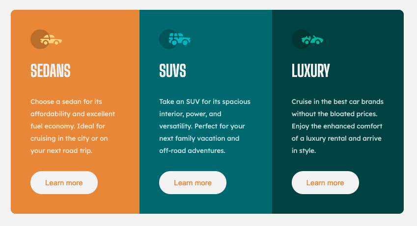

# Frontend Mentor - 3-column preview card component solution

This is a solution to the [3-column preview card component challenge on Frontend Mentor](https://www.frontendmentor.io/challenges/3column-preview-card-component-pH92eAR2-). Frontend Mentor challenges help you improve your coding skills by building realistic projects. 

## Table of contents

- [Overview](#overview)
  - [The challenge](#the-challenge)
  - [Screenshot](#screenshot)
  - [Links](#links)
- [My process](#my-process)
  - [Built with](#built-with)
  - [What I learned](#what-i-learned)
  - [Continued development](#continued-development)
  - [Useful resources](#useful-resources)
- [Author](#author)
## Overview

### The challenge

Users should be able to:

- View the optimal layout depending on their device's screen size
- See hover states for interactive elements

### Screenshot



### Links

- Solution URL: [Add solution URL here](https://your-solution-url.com)
- Live Site URL: [Add live site URL here](https://your-live-site-url.com)

## My process

### Built with

- Semantic HTML5 markup
- BEM Methodology
- CSS
- Flexbox
- Mobile-first workflow
### What I learned

With this exercise i learned how to implement BEM methodology in my future projects

To see how you can add code snippets, see below:

```html
<div class="card card--bright-orange">
  <div class="card__icon">
    
  </div>
  <div class="card__title">Sedans</div>
  <div class="card__description">
    Choose a sedan for its affordability and excellent fuel
    economy. Ideal for cruising in the city or on your next
    road trip.
  </div>
  <div class="card__button">
    <button>Learn more</button>
  </div>
</div>
```
```css
.app .main-container {
  width: 85%;
  background-color: rgb(139, 139, 9);
  border-radius: 10px;
  margin: 6rem 3rem;
  overflow: hidden;
}
```
### Continued development

I was really loved with BEM methodology, so i decided implement it in my next future projects

### Useful resources

- https://css-tricks.com/a-complete-guide-to-css-media-queries/ - This helped me for creating media queries, responsive design.
## Author

- Website - [Dennis Montores](https://dennismontores.github.io/)
- Frontend Mentor - [@sinnedserotnom](https://www.frontendmentor.io/profile/sinnedserotnom)
- Twitter - [@sinnedserotnom](https://www.twitter.com/sinnedserotnom)
